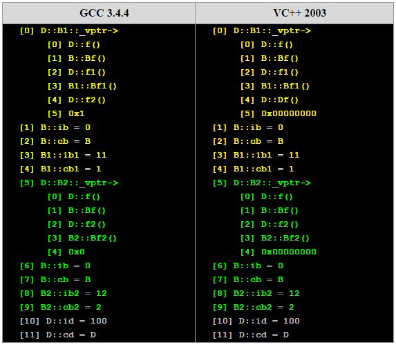
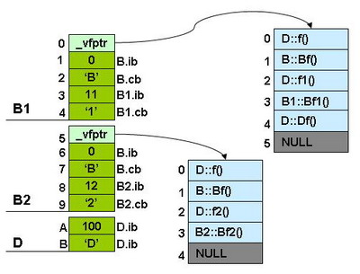

# 多继承

#### 无虚函数覆盖的多重继承

那么，我们来看看多重继承中的情况，假设有下面这样一个类的继承关系。注意：子类并没有覆盖父类的函数。

我们的类继承的源代码如下所示：父类的成员初始为10，20，30，子类的为100


class Base1 {
public:
    int ibase1;
    Base1():ibase1(10) {}
    virtual void f() { cout << "Base1::f()" << endl; }
    virtual void g() { cout << "Base1::g()" << endl; }
    virtual void h() { cout << "Base1::h()" << endl; }
 
};
 
class Base2 {
public:
    int ibase2;
    Base2():ibase2(20) {}
    virtual void f() { cout << "Base2::f()" << endl; }
    virtual void g() { cout << "Base2::g()" << endl; }
    virtual void h() { cout << "Base2::h()" << endl; }
};
 
class Base3 {
public:
    int ibase3;
    Base3():ibase3(30) {}
    virtual void f() { cout << "Base3::f()" << endl; }
    virtual void g() { cout << "Base3::g()" << endl; }
    virtual void h() { cout << "Base3::h()" << endl; }
};
 
class Derive : public Base1, public Base2, public Base3 {
public:
    int iderive;
    Derive():iderive(100) {}
    virtual void f() { cout << "Derive::f()" << endl; }
    virtual void g1() { cout << "Derive::g1()" << endl; }
};

typedef void(*Fun)(void);

int main()
{
    Derive d;
	Fun pFun = NULL;
 
	int** pVtab = (int**)&d;
	 
	cout << "[0] Base1::_vptr->" << endl;
	pFun = (Fun)pVtab[0][0];
	cout << "     [0] ";pFun();
	 
	pFun = (Fun)pVtab[0][1];
	cout << "     [1] ";pFun();
	 
	pFun = (Fun)pVtab[0][2];
	cout << "     [2] ";pFun();
	 
	pFun = (Fun)pVtab[0][3];
	cout << "     [3] "; pFun();
	 
	pFun = (Fun)pVtab[0][4];
	cout << "     [4] "; cout<<pFun<<endl;
	 
	cout << "[1] Base1.ibase1 = " << (int)pVtab[1] << endl;
	 
	int s = sizeof(Base1)/4;
	 
	cout << "[" << s << "] Base2::_vptr->"<<endl;
	pFun = (Fun)pVtab[s][0];
	cout << "     [0] "; pFun();
	 
	pFun = (Fun)pVtab[s][1];
	cout << "     [1] "; pFun();
	 
	pFun = (Fun)pVtab[s][2];
	cout << "     [2] "; pFun();
	 
	pFun = (Fun)pVtab[s][3];
	cout << "     [3] ";
	cout<<pFun<<endl;
	 
	cout << "["<< s+1 <<"] Base2.ibase2 = " << (int)pVtab[s+1] << endl;
	 
	s = s + sizeof(Base2)/4;
	 
	cout << "[" << s << "] Base3::_vptr->"<<endl;
	pFun = (Fun)pVtab[s][0];
	cout << "     [0] "; pFun();
	 
	pFun = (Fun)pVtab[s][1];
	cout << "     [1] "; pFun();
	 
	pFun = (Fun)pVtab[s][2];
	cout << "     [2] "; pFun();
	 
	pFun = (Fun)pVtab[s][3];
	cout << "     [3] ";
	cout<<pFun<<endl;
	 
	s++;
	cout << "["<< s <<"] Base3.ibase3 = " << (int)pVtab[s] << endl;
	s++;
	cout << "["<< s <<"] Derive.iderive = " << (int)pVtab[s] << endl;
    
    return 0;
}


上面程序中，注意使用了一个`s`变量，其中用到了`sizof(Base1)`来找下一个类的偏移量（因为声明的基类中成员是`int`成员，所以是`8`个字节要加上虚函数表地址所占`4`个字节，所以没有对齐问题）。输出结果：


[0] Base1::_vptr->
     [0] Derive::f()
     [1] Base1::g()
     [2] Base1::h()
     [3] Derive::g1()
     [4] 1
[1] Base1.ibase1 = 10
[2] Base2::_vptr->
     [0] Derive::f()
     [1] Base2::g()
     [2] Base2::h()
     [3] 1
[3] Base2.ibase2 = 20
[4] Base3::_vptr->
     [0] Derive::f()
     [1] Base3::g()
     [2] Base3::h()
     [3] 0
[5] Base3.ibase3 = 30
[6] Derive.iderive = 100


使用图片表示则是这个样子：

可以发现：

- 每个父类都有自己的虚表；
- 子类的成员函数被放到了第一个父类的表中；
- 内存布局中，其父类布局依次按声明顺序排列；
- 每个父类的虚表中的'f()'函数都被'overwrite'成了子类的'f()'。这样做就是为了解决不同的父类类型的指针指向同一个子类实例，而能够调用到实际的函数。

###### 思考这个问题：如果`Base1`中函数均不是虚函数会有什么变化呢？答案是：子类对象的内存布局中会少一个虚函数表。至于基类的顺序 T_T.

代码的变化：


class Base1 {
public:
    int ibase1;
    Base1():ibase1(10) {}
    void f() { cout << "Base1::f()" << endl; }
    void g() { cout << "Base1::g()" << endl; }
    void h() { cout << "Base1::h()" << endl; }
 
};

int main()
{
    Derive d;
    Fun pFun = NULL;
    int** pVtab = (int**)&d;
	
    cout << "[" << 0 << "] Base2::_vptr->"<<endl;
    pFun = (Fun)pVtab[0][0];
    cout << "     [0] "; pFun();
    
    pFun = (Fun)pVtab[0][1];
    cout << "     [1] "; pFun();
    
    pFun = (Fun)pVtab[0][2];
    cout << "     [2] "; pFun();
    
    pFun = (Fun)pVtab[0][3];
    cout << "     [3] ";
    cout<<pFun<<endl;
    
    cout << "[1] Base2.ibase2 = " << (int)pVtab[1] << endl;
    cout << "[2] Base1.ibase1 = " << (int)pVtab[2] << endl;

    cout << "[3] Base2::_vptr->"<<endl;
    pFun = (Fun)pVtab[3][0];
    cout << "     [0] "; pFun();
    
    pFun = (Fun)pVtab[3][1];
    cout << "     [1] "; pFun();
    
    pFun = (Fun)pVtab[3][2];
    cout << "     [2] "; pFun();
    
    pFun = (Fun)pVtab[3][3];
    cout << "     [3] ";
    cout<<pFun<<endl;

    cout << "[4] Base3.ibase3 = " << (int)pVtab[4] << endl;
    cout << "[5] Derive.iderive = " << (int)pVtab[5] << endl;
    return 0;
}


代码为什么这么些，因为我费了点时间，测试子类对象的布局。输出的结果：


[0] Base2::_vptr->   // 第一个基类竟然是 Base1
     [0] Derive::f()
     [1] Base2::g()
     [2] Base2::h()
     [3] 1
[1] Base2.ibase2 = 20
[2] Base1.ibase1 = 10 // Base1 位置
[3] Base2::_vptr->
     [0] Derive::f()
     [1] Base3::g()
     [2] Base3::h()
     [3] 0
[4] Base3.ibase3 = 30
[5] Derive.iderive = 100


本来认为基类顺序是不发生变化的，可是写的测试代码竟然不对呀。所以可以发现：

- 非虚继承方式，子类对象的虚函数表个数和基类的个数一致
- 基类顺序发生变化，排第一顺位的是第一个有虚函数的基类（原因：子类有虚函数，那么首位必须是虚函数表了）

###### 那么，再思考个问题吧（就是这么shierma...哈哈

如果第一个基类中没有虚函数，而将子类覆写的虚函数换成`g()`会怎样？（顺带将子类中的`g1()->f1()`）

代码变化部分：


class Derive : public Base1, public Base2, public Base3 {
public:
    int iderive;
    Derive():iderive(100) {}
    virtual void f1() { cout << "Derive::f1()" << endl; }
    virtual void g() { cout << "Derive::g()" << endl; }
};


结果：


[0] Base2::_vptr->
     [0] Base2::f()
     [1] Derive::g()
     [2] Base2::h()
     [3] 1
[1] Base2.ibase2 = 20
[2] Base1.ibase1 = 10
[3] Base2::_vptr->
     [0] Base3::f()
     [1] Derive::g()
     [2] Base3::h()
     [3] 0
[4] Base3.ibase3 = 30
[5] Derive.iderive = 100


记得，我在单继承那节有提出一个问题，结合这里的输出结果，基本可以了解`C++`实现多态的原理了，敲黑板：

对于非虚函数，编译时就可以得到被调用函数的地址（如果被调用函数在子类中没有匹配类型，就向上找父类中名字一样函数进行匹配）；对于虚函数，因为函数在虚函数表中的位置是固定的，那么编译器会替换成虚函数表的地址加该虚函数对应的偏移。这里是我先想出来然后代码验证的，因为感觉这样才能实现嘛 ^_^.

下面是重复继承，还有这么多，不想写了呀（模仿欧弟二柱子声音^_^）！桌子掀了就要摆好 ┬─┬ ノ('-'ノ) （还是掀了算了） (╯°Д°)╯︵ ┻━┻.

#### 重复继承

那么，再来看看，发生重复继承的情况。所谓重复继承，也就是某个基类被间接地重复继承了多次。下图是一个继承图，我们重载了父类的f()函数。

其类继承的源代码如下所示。其中，每个类都有两个变量，一个是整形（`4`字节），一个是字符（`1`字节），而且还有自己的虚函数，自己`overwrite`父类的虚函数。如子类`D`中，`f()`覆盖了超类的函数， `f1()` 和`f2()` 覆盖了其父类的虚函数，`Df()`为自己的虚函数。


class B
{
    public:
        int ib;
        char cb;
    public:
        B():ib(0),cb('B') {}
 
        virtual void f() { cout << "B::f()" << endl;}
        virtual void Bf() { cout << "B::Bf()" << endl;}
};
class B1 :  public B
{
    public:
        int ib1;
        char cb1;
    public:
        B1():ib1(11),cb1('1') {}
 
        virtual void f() { cout << "B1::f()" << endl;}
        virtual void f1() { cout << "B1::f1()" << endl;}
        virtual void Bf1() { cout << "B1::Bf1()" << endl;}
 
};
class B2:  public B
{
    public:
        int ib2;
        char cb2;
    public:
        B2():ib2(12),cb2('2') {}
 
        virtual void f() { cout << "B2::f()" << endl;}
        virtual void f2() { cout << "B2::f2()" << endl;}
        virtual void Bf2() { cout << "B2::Bf2()" << endl;}
 
};
 
class D : public B1, public B2
{
    public:
        int id;
        char cd;
    public:
        D():id(100),cd('D') {}
 
        virtual void f() { cout << "D::f()" << endl;}
        virtual void f1() { cout << "D::f1()" << endl;}
        virtual void f2() { cout << "D::f2()" << endl;}
        virtual void Df() { cout << "D::Df()" << endl;}
 
};

typedef void(*Fun)(void);

int main()
{
    D d;
    Fun pFun = NULL;
    int** pVtab = (int**)&d;
	
    cout << "[0] D::B1::_vptr->" << endl;
    pFun = (Fun)pVtab[0][0];
    cout << "     [0] ";    pFun();
    pFun = (Fun)pVtab[0][1];
    cout << "     [1] ";    pFun();
    pFun = (Fun)pVtab[0][2];
    cout << "     [2] ";    pFun();
    pFun = (Fun)pVtab[0][3];
    cout << "     [3] ";    pFun();
    pFun = (Fun)pVtab[0][4];
    cout << "     [4] ";    pFun();
    pFun = (Fun)pVtab[0][5];
    cout << "     [5] 0x" << pFun << endl;
     
    cout << "[1] B::ib = " << (int)pVtab[1] << endl;
    cout << "[2] B::cb = " << (char)(int)pVtab[2] << endl;
    cout << "[3] B1::ib1 = " << (int)pVtab[3] << endl;
    cout << "[4] B1::cb1 = " << (char)(int)pVtab[4] << endl;
     
    cout << "[5] D::B2::_vptr->" << endl;
    pFun = (Fun)pVtab[5][0];
    cout << "     [0] ";    pFun();
    pFun = (Fun)pVtab[5][1];
    cout << "     [1] ";    pFun();
    pFun = (Fun)pVtab[5][2];
    cout << "     [2] ";    pFun();
    pFun = (Fun)pVtab[5][3];
    cout << "     [3] ";    pFun();
    pFun = (Fun)pVtab[5][4];
    cout << "     [4] 0x" << pFun << endl;
     
    cout << "[6] B::ib = " << (int)pVtab[6] << endl;
    cout << "[7] B::cb = " << (char)(int)pVtab[7] << endl;
    cout << "[8] B2::ib2 = " << (int)pVtab[8] << endl;
    cout << "[9] B2::cb2 = " << (char)(int)pVtab[9] << endl;
     
    cout << "[10] D::id = " << (int)pVtab[10] << endl;
    cout << "[11] D::cd = " << (char)(int)pVtab[11] << endl;
    return 0;
}


输出结果：

这里直接使用了`酷壳`的图片，因为结果是一样的，我的`gcc`版本之前说过了已经到`6`了。新技术不断发展，但是大厦基础是不怎么变动的。

下面是对于子类实例中的虚函数表的图：

可以看见，最顶端的父类`B`其成员变量存在于`B1`和`B2`中，并被`D`给继承下去了。而在`D`中，其有`B1`和`B2`的实例，于是`B`的成员在`D`的实例中存在两份，一份是`B1`继承而来的，另一份是`B2`继承而来的。所以，如果我们使用以下语句，则会产生二义性编译错误：


D d;
d.ib = 0; //二义性错误
d.Bf();   //二义性错误
d.B1::ib = 1; //正确
d.B2::ib = 2; //正确
// end


注意，上面例程中的最后两条语句存取的是两个变量。虽然我们消除了二义性的编译错误，但`B`类在`D`中还是有两个实例，这种继承造成了数据的重复，我们叫这种继承为重复继承。重复的基类数据成员可能并不是我们想要的。所以，`C++`引入了虚基类的概念。