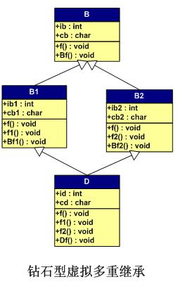

# 多虚继承

虚拟继承就是为了解决重复继承多个间接父类的问题。最简单的应该就是就是本`GitBook`多继承那节的钻石型结构的问题，重复继承。如下图所示：

将带虚函数多继承那节的`B1`和`B2`前面加上`virtual`关键字，就使用了虚拟继承，那么代码只给出有改动的地方：


class B { };
class B1 : virtual public B{ };
class B2: virtual public B{ };
class D : public B1, public B2{ };

typedef void(*Fun)(void);

int main()
{
    D dd;
    Fun pFun = NULL;
    int** pVtab = (int**)&dd;
    cout << "bytes of dd: " << sizeof(dd)/4 << endl;

    cout << "[0] B1::_vptr->" << endl;
    pFun = (Fun)pVtab[0][0];
    cout << "     [0] ";    pFun(); //D::f();
    pFun = (Fun)pVtab[0][1];
    cout << "     [1] ";    pFun(); //D::f1()
    pFun = (Fun)pVtab[0][2];
    cout << "     [2] ";    pFun(); //B1::Bf1();
    pFun = (Fun)pVtab[0][3];
    cout << "     [3] ";
    cout << pFun << endl;
    pFun = (Fun)pVtab[0][4];
    cout << "     [4] ";    pFun(); //D::Df();

    cout << "[1] B1::ib1 = ";
    cout << (int)*((int*)(&dd)+1) <<endl; //B1::ib1
    cout << "[2] B1::cb1 = ";
    cout << (char)*((int*)(&dd)+2) << endl; //B1::cb1

    cout << "[3] B2::_vptr->" << endl;
    pFun = (Fun)pVtab[3][0];
    cout << "     [0] ";    pFun(); //D::f();
    pFun = (Fun)pVtab[3][1];
    cout << "     [1] ";    pFun(); //D::f2();
    pFun = (Fun)pVtab[3][2];
    cout << "     [2] ";    pFun(); //B2::Bf2();
    pFun = (Fun)pVtab[3][3];
    cout << "     [3] ";
    cout << pFun << endl;

    cout << "[4] B2::ib2 = ";
    cout << (int)*((int*)(&dd)+4) <<endl; //B2::ib2
    cout << "[5] B2::cb2 = ";
    cout << (char)*((int*)(&dd)+5) << endl; //B2::cb2

    cout << "[6] D::id = ";
    cout << *((int*)(&dd)+6) << endl; //D::id
    cout << "[7] D::cd = ";
    cout << (char)*((int*)(&dd)+7) << endl << endl;//D::cd
    cout << "[9] B::ib = ";
    cout << *((int*)(&dd)+9) << endl; //B::ib
    cout << "[10] B::cb = ";
    cout << (char)*((int*)(&dd)+10) <<endl;//B::cb
    cout << "[11]        ";
    cout << *((int*)(&dd)+11) << endl;
    cout << "[12] NULL : ";
    cout << *((int*)(&dd)+12) << endl;

    cout << "[8] B::_vptr->" << endl;
    pFun = (Fun)pVtab[8][0];
    cout << "     [0] ";    pFun(); //D::f();
    pFun = (Fun)pVtab[8][1];
    cout << "     [1] ";    pFun(); //B::Bf();
    pFun = (Fun)pVtab[8][2];
    cout << "     [2] ";
    cout << pFun << endl;

    return 0;
}


输出结果：


bytes of dd: 11
[0] B1::_vptr->
     [0] D::f()
     [1] D::f1()
     [2] B1::Bf1()
     [3] 1
     [4] D::Df()
[1] B1::ib1 = 11
[2] B1::cb1 = 1
[3] B2::_vptr->
     [0] D::f()
     [1] D::f2()
     [2] B2::Bf2()
     [3] 0
[4] B2::ib2 = 12
[5] B2::cb2 = 2
[6] D::id = 100
[7] D::cd = D

[9] B::ib = 0
[10] B::cb = B
[11]        -4446372
[12] NULL : 0
[8] B::_vptr->
Segmentation fault (核心已转储)
// end


上面结果中，应该指向基类`B`的虚函数表的地方，报错了也没有找到原因，有可能是编译器限制这种访问方式。并且不知为何在`dd`的最后一个字节是个负数。

`陈皓`在[酷壳]()中给出了内存分布，`VC`的应该是正确的，`gcc`的有一处错误，就不贴了。

#### 小结

感觉虚继承多继承是不如`Java`单继承简洁，但是`Java`的接口应该合着个类似吧（接口可以影响子类）。另，`Java`接口可以有变量不过必须是`public static final`.