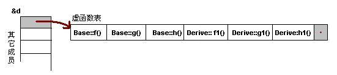
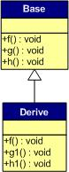

# 单继承

#### 带虚函数的类

已经知道，如果一个类中有虚函数那么编译器会给这个类创建一个虚函数表。更进一步，这个类的每个实例的首地址开始`4`个字节存放着指向该虚函数表的指针。

下面，用代码进行验证：


class Base {
public:
    int i_a;
    virtual void f() { cout << "Base::f" << endl; }
    virtual void g() { cout << "Base::g" << endl; }
    virtual void h() { cout << "Base::h" << endl; }
};

typedef void(*Fun)(void);

int main()
{
    Base b;
    b.i_a = 10;

    Fun pFun = NULL;

    cout << "虚函数表地址：" << (int*)(&b) << endl;
    cout << "虚函数表 — 第一个函数地址：" << (int*)*(int*)(&b) << endl;

    // Invoke the first virtual function
    pFun = (Fun)*((int*)*(int*)(&b));
    pFun();
    
    int *p_i = (int*)(&b)+1;
    cout << *p_i << endl;
    return 0;
}

// output
虚函数表地址：0xffd77ef8
虚函数表 — 第一个函数地址：0x80489e8
Base::f  // 输出的内容确实是第一个虚函数的内容
10       // 输出了对象`b`的成员`i_a`
// end


上面这个代码，如果能理解那对指针已经有一定掌握了。

`(int*)&b`这里类似于`int *p = （int*)&b`，那么`*p = *(int*)&b`就表示得到了对象`b`前`4`个字节的数字，也就是虚函数表的首地址。

那么调用`Base::g()`的代码则为：`(Fun)*((int*)*(int*)(&b)+1)`。

由上面可以得到对象`b`的内存布局为：

#### 无虚函数覆盖的单继承

假如有如下的继承关系：

那么，对于实例：`Derive d`虚函数表如下：

可以发现以下两点：

- 虚函数按照其声明顺序放于表中
- 父类的虚函数在子类的虚函数前面

那知道为什么要这么做么？想清楚 ^_^

另外，如果基类和子类都有有成员变量，应该在放在图中哪个位置？

#### 有虚函数覆盖的单继承

既然定义了虚函数，自然是用来覆盖的，不然就没有意义了啊。况且还有纯虚函数（那样这个类就是抽象类了）。假设有如下的继承关系：

在上面的设计中，只覆盖了父类的一个函数：`f()`。那么对于派生类的实例，它的内存布局是这样的：

那么，按照下面的程序运行时就实现了多态！


Base *b = new Derive();
b->f();


本`GitBook`挖的坑，后面都有填。。。